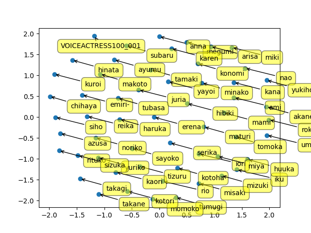

# Speaker-Embeddings
Feedforward network generating speaker embeddings 

## dependency
- python3.7

## Data preprocessing
We assume that jvs corpus is put in the directory (../japanese_speech_corpus/jvs_ver1/).  
If you execute following command, audio files are conveted into mel cepstrum coefficient in *.npy file format.  
npy files include the two contents.
- parallel100 (for test)
- nonpara30 (for training)
```commandline
$ python preprocess.py
``` 

## Model training
The model is trained using nonpara30 in jvs corpus.  
Trainging parameters is defined in config/config.yaml.  
After do following, the model file is saved in model/ckpt/final_epoch_{}.model
```commandline
$ python train.py
```

## Create similarity matrix using user voice
You can do following command to create similarity matrix which includes voice actor's voice and your voice.
```commandline
$ python create_simmat.py [your wav data] [gender("female" or "male")]
```

## Visualize similarity matrix
The output matrix can be visualized by following command.
```commandline
$ python viz.py [similarity matrix filename] [output png filename]
```

